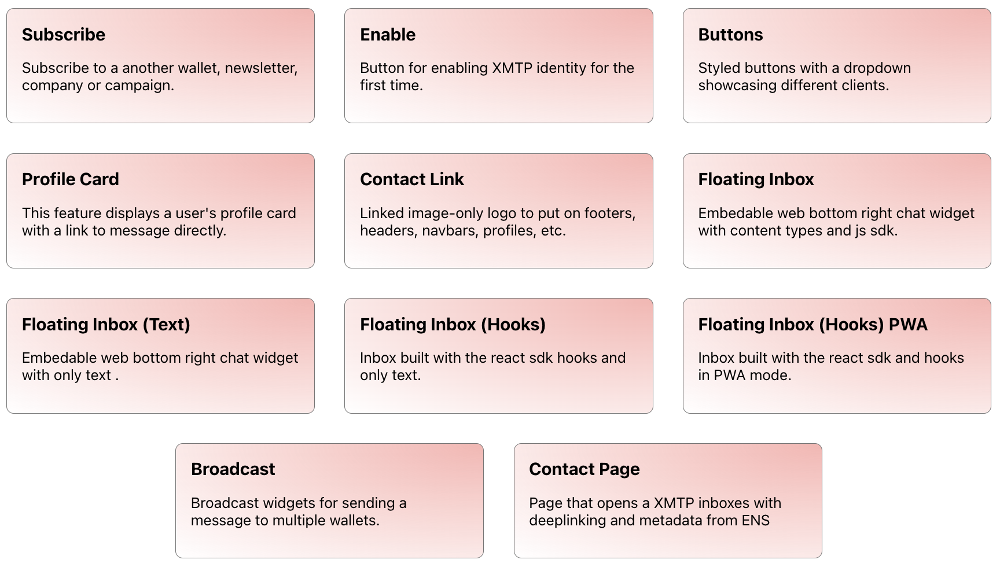

# XMTP Prototypes

## Installation

```bash
bun install
bun start
```

## Prototypes



- [**Subscribe**](https://docs.xmtp.org/docs/integrations/Subscribe): Subscribe to another wallet, newsletter, company or campaign.

- [**Enable**](https://docs.xmtp.org/docs/integrations/Enable): Button for enabling XMTP identity for the first time.

- [**Buttons**](https://docs.xmtp.org/docs/integrations/Button): Styled buttons with a dropdown showcasing different clients.

- [**Profile Card**](https://docs.xmtp.org/docs/integrations/ProfileCard): This feature displays a user's profile card with a link to message directly.

- [**Contact Link**](https://docs.xmtp.org/docs/integrations/ContactLink): Linked image-only logo to put on footers, headers, navbars, profiles, etc.

- [**Floating Inbox**](https://docs.xmtp.org/docs/integrations/FloatingInbox): Embeddable web bottom right chat widget with content types and js sdk.

- [**Floating Inbox (Text)**](https://docs.xmtp.org/docs/integrations/FloatingInboxText): Embeddable web bottom right chat widget with only text.

- [**Floating Inbox (Hooks)**](https://docs.xmtp.org/docs/integrations/FloatingInboxHooks): Inbox built with the react sdk hooks and only text.

- [**Floating Inbox (Hooks) PWA**](https://docs.xmtp.org/docs/integrations/FloatingInboxHooksPWA): Inbox built with the react sdk and hooks in PWA mode.

- [**Broadcast**](https://docs.xmtp.org/docs/integrations/Broadcast): Broadcast widgets for sending a message to multiple wallets.

- [**Contact Page**](https://docs.xmtp.org/docs/integrations/ContactPage): Page that opens a XMTP inboxes with deeplinking and metadata from ENS.
